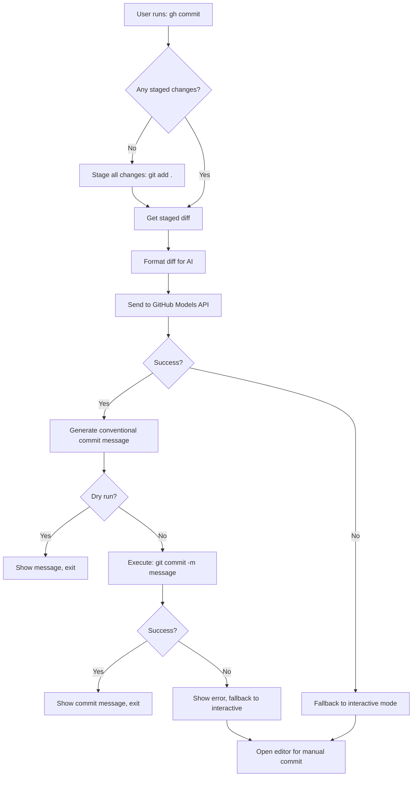

# gh-commit: AI-Powered Git Commit Message Generator

**Date:** 2026-04-17
**Author:** Design specification for GitHub CLI extension
**Status:** Approved

## Overview

A GitHub CLI extension that automatically generates Conventional Commits messages using GitHub Models API and commits them. The extension analyzes staged git changes (or auto-stages if needed), generates an appropriate commit message, and commits automatically - with intelligent error handling that falls back to interactive mode when needed.

## Goals

- Automate commit message generation using AI
- Follow Conventional Commits format
- Auto-stage changes if nothing is staged
- Provide graceful error handling with interactive fallback
- Leverage free GitHub Models API (no API key needed)

## Architecture

### Components

**1. Git Client** (`internal/git/client.go`)
- Checks for staged changes
- Auto-stages all changes if needed (`git add .`)
- Captures full diff of staged changes (`git diff --cached`)
- Executes commit with generated message
- Handles interactive fallback mode

**2. LLM Client** (`internal/llm/client.go`)
- Integrates with GitHub Models API
- Uses Conventional Commits prompt configuration
- Sends full diff for AI analysis
- Returns formatted commit message
- Handles API errors gracefully

**3. Main CLI** (`cmd/commit/main.go`)
- Orchestrates the complete workflow
- Manages flags and user options
- Coordinates git and LLM operations
- Provides clear status messages

### Dependencies

- `github.com/cli/go-gh/v2` - GitHub CLI integration
- `github.com/spf13/cobra` - CLI framework
- Standard library: `os/exec`, `io/ioutil`, `fmt`, `bytes`

## Data Flow



## CLI Interface

### Command

```bash
gh commit
```

### Flags

- `--model, -m string` - GitHub Models model to use (default: `openai/gpt-4o`)
- `--dry-run` - Show what would be done without actually committing

### Usage Examples

```bash
# Basic usage (auto-stage + generate + commit)
gh commit

# Use a different model
gh commit --model openai/gpt-4o-mini

# Dry run to see what would be committed
gh commit --dry-run

# Both options together
gh commit --model xai/grok-3-mini --dry-run
```

### Example Output

```
Checking for staged changes...
No staged changes found. Staging all changes...
Staged 5 files
Generating commit message using openai/gpt-4o...
Generated: feat(auth): add JWT token refresh mechanism
Committing...
✅ Committed successfully: feat(auth): add JWT token refresh mechanism
```

## AI Prompt Design

### System Message

```
You are an expert developer who writes clear, concise Conventional Commits messages.
Your task is to analyze git diffs and generate conventional commit messages.

Conventional Commits format:
- type(scope): description

Types: feat, fix, docs, style, refactor, test, chore, perf, ci, build, revert
Scope: Optional, typically the module/component affected
Description: Imperative mood, lowercase, no period

Examples:
- feat(auth): add JWT token refresh mechanism
- fix(api): resolve memory leak in request handler
- docs(readme): update installation instructions
- refactor(database): extract query builder to separate module
```

### User Message Template

```
Analyze the following git diff and generate a conventional commit message.
Focus on WHAT changed and WHY, not HOW.

Diff:
{{diff}}

Requirements:
- Use conventional commit format: type(scope): description
- Choose the most appropriate type (feat/fix/docs/refactor/etc.)
- Keep description under 72 characters
- Use imperative mood ("add" not "added")
- If scope is unclear, omit it
- Provide only the commit message, nothing else

Commit message:
```

## Error Handling

### Failure Scenarios

1. **No changes at all** (staged or unstaged)
   - Show error: "No changes detected. Please make some changes first."
   - Exit with code 1

2. **GitHub Models API failure**
   - Show error details
   - Fallback: Open editor with pre-filled message: `"AI generation failed. Please write commit message manually."`
   - Allow manual commit

3. **Git commit failure**
   - Show git error output
   - Fallback: Open editor with generated message for manual retry
   - Common issues: merge conflicts, hooks that fail

4. **Stage failure** (`git add .` fails)
   - Show error
   - Suggest manual staging: "Please run `git add <files>` and try again"

### Interactive Fallback

```go
func fallbackToInteractive(message string) error {
    // Create temp file with message
    // Open $EDITOR (or vim as fallback)
    // Read result and commit
}
```

## File Structure

```
gh-commit/
├── extension.yml              # GitHub CLI extension manifest
├── go.mod                     # Go module definition
├── go.sum                     # Go dependencies lock
├── Makefile                   # Build commands
├── README.md                  # Documentation
├── cmd/
│   └── commit/
│       └── main.go           # CLI entry point
├── internal/
│   ├── git/
│   │   ├── client.go         # Git operations (stage, diff, commit)
│   │   └── client_test.go    # Git client tests
│   ├── llm/
│   │   ├── client.go         # GitHub Models API client
│   │   ├── client_test.go    # LLM client tests
│   │   └── commit.prompt.yml # Conventional Commits prompt
│   └── types/
│       └── commit.go         # Type definitions
└── .github/
    └── workflows/
        └── ci.yml            # CI/CD (optional)
```

## Extension Manifest

**extension.yml:**
```yaml
name: commit
owner: gh-commit
host: github.com
tag: v1.0.0
```

## Testing Strategy

### Unit Tests
- `internal/git/client_test.go`: Mock git commands, test staging/diff/committing
- `internal/llm/client_test.go`: Mock HTTP requests to GitHub Models API

### Integration Tests
- Test with real git operations in temporary repositories
- Verify staged changes detection
- Test auto-staging behavior
- Validate diff capture

### Manual Testing Checklist
- [ ] Fresh repo with no changes (should error)
- [ ] Unstaged changes only (should auto-stage)
- [ ] Staged changes (should use existing)
- [ ] Mixed staged + unstaged (should use staged only)
- [ ] Dry-run mode (should not commit)
- [ ] Different models
- [ ] Error fallback (invalid model, git conflicts)

## Implementation Notes

### Key Differences from gh-standup

1. **Git Operations**: Uses `os/exec` for git commands instead of GitHub API
2. **Prompt Focus**: Conventional Commits format instead of standup reports
3. **Auto-Staging**: Automatically stages changes if needed
4. **Direct Commit**: Executes git commit instead of just generating text

### GitHub Models API Integration

- Endpoint: `https://models.github.ai/inference/chat/completions`
- Authentication: Bearer token from GitHub CLI (`gh auth token`)
- Model: Default `openai/gpt-4o`, configurable via flag
- Temperature: 0.7 for consistent output

## Success Criteria

- ✅ Generates valid Conventional Commits messages
- ✅ Handles staged and unstaged changes correctly
- ✅ Auto-stages when needed without losing data
- ✅ Falls back to interactive mode on errors
- ✅ Works with various git scenarios (merge conflicts, hooks, etc.)
- ✅ Provides clear user feedback throughout the process

## Next Steps

1. Create implementation plan using writing-plans skill
2. Implement Git client with staging and diff operations
3. Implement LLM client with Conventional Commits prompt
4. Implement main CLI workflow with error handling
5. Add comprehensive tests
6. Document usage and installation
7. Publish as GitHub CLI extension
